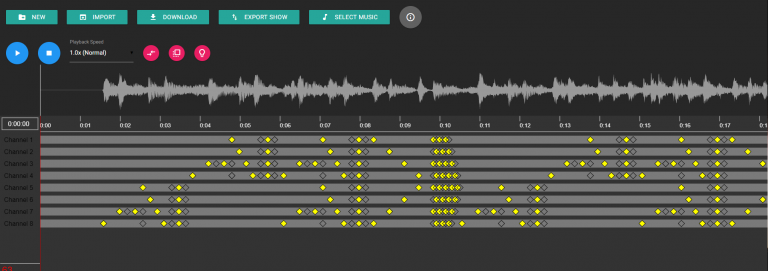

> Note Dec 2018: an updated version of the project running on Node.js and React is currently in development. The new project has advanced features, such as the ability to skip songs, set timers, and configure the pinout through the web interface. You can [view a demo](https://relaxed-austin-5bfa65.netlify.com/) of what the project would look like when installed, or you can [check out the source code](https://github.com/gregoryjjb/bethlehem).

The show runs on a Raspberry Pi and utilizes 8 channels. The project consisted of two parts: an editor to create the shows, and a player.

Final result:

<iframe width="560" height="315" style="margin-left: auto; margin-right: auto;" src="https://www.youtube.com/embed/jkk-ZqFBmM4" frameborder="0" allow="autoplay; encrypted-media" allowfullscreen></iframe>

## Show Editor

The editor provides a GUI to create simple shows where channels can be turned on and off in time with the music. The show data can be exported as JSON or as a simple list of timestamps and keyframes.

You can [create your own show here](https://apps.gregbrisebois.com/show-editor/) or [view the source code](https://github.com/gregoryjjb/show-editor).

## Show Player

The player runs on the Pi. It utilizes Python to read the show files, PHP to run the Python scripts, and a locally hosted web page to control the show. It also includes a copy of the show editor, so shows can be designed on the Pi without any importing/exporting.

You can [view/download the source code here](https://github.com/gregoryjjb/show-server). See the readme for a guide on getting set up.