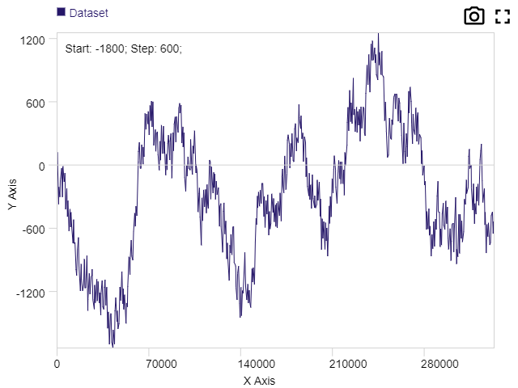

I was recently attempting to replace some native data capture software with a web-based version and came across the problem of displaying data. While many plotting solutions exist, I wasn't able to find any (free) ones that were able to handle the data I wanted to show. So, I decided to try my hand at making my own.

Originally I was planning to display data rendered natively server-side, but it turned out that V8 is actually pretty darn fast. I was able to push it up to tens of millions of points using cleverly-timed downsampling (largest triangle three buckets) and ignoring data that I didn't need at the moment. The bottleneck eventually turned out to be space; too many points would cause the Chrome tab to run out of memory.

<a href="https://focused-almeida-5122b7.netlify.com/" target="_blank">Try out the live demo with 1M points here!</a>

I'm pretty happy with the result, but it needs some usability and configuration tweaks to make it more versatile.