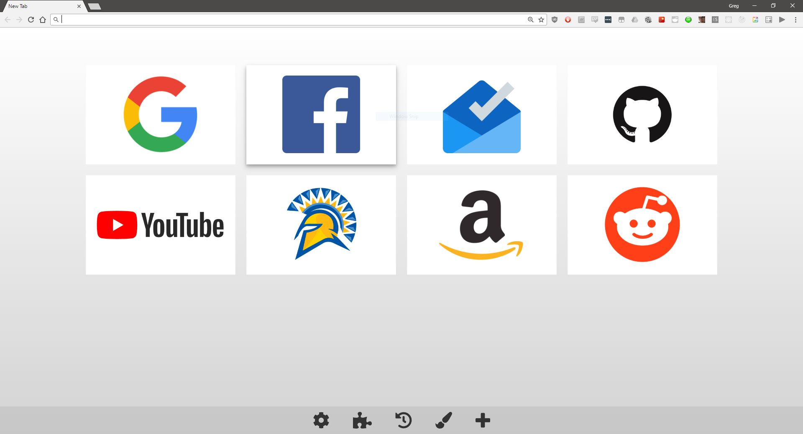

I was underwhelmed with the existing offering of new tab extensions on the Chrome web store.
I wanted a very particular set of features:

1. Large shortcuts, placed and editable by hand
2. Shortcuts and settings sync across devices
3. Nothing else that would reduce speed (clock, weather, to-do list, etc)

Previously I had been using [Speed Dial 2](https://chrome.google.com/webstore/detail/speed-dial-2-new-tab/jpfpebmajhhopeonhlcgidhclcccjcik),
which ticked most of my boxes, but syncing was a paid feature.

After trying about 5 or 6 different extensions I had the idea to whip up my own.
Enter: [UtiliTab](https://chrome.google.com/webstore/detail/utilitab/poodedipoelbijcbigkmbgpjipbjjhil).

It's extremly basic, but it covers all the basics just like I wanted. I've been using it for the last 
couple months and I've found it very handy. It supports adding/editing/removing bookmarks, changing
spacing and padding, and has links to Chrome pages (history, extensions, etc).

There's a few features I would still like to add:
* Reordering links
* Background color (or image) selection

You can download it from the [Chrome web store](https://chrome.google.com/webstore/detail/utilitab/poodedipoelbijcbigkmbgpjipbjjhil) if you want to try it out.